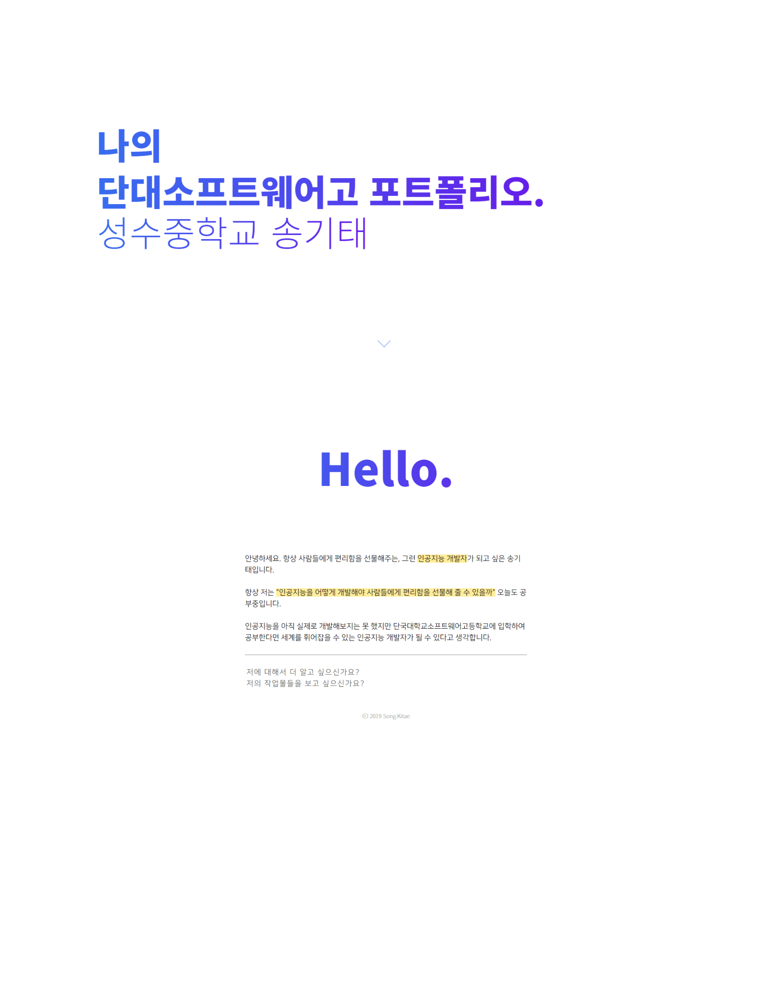
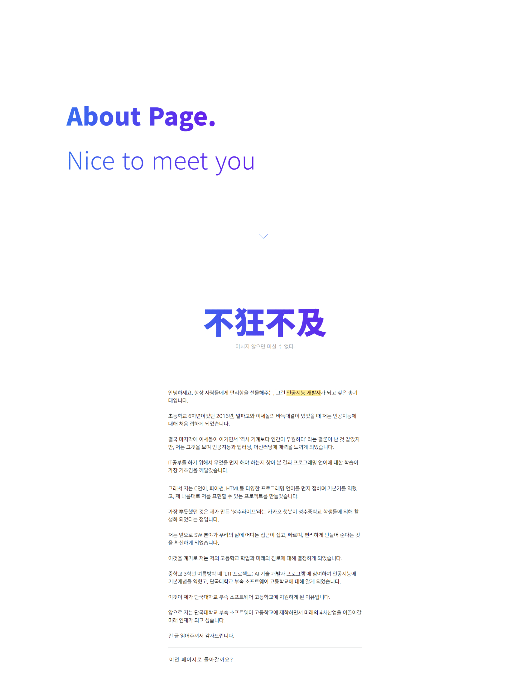

# Kitae's Portfolio Website ver2.0 (for 2020)

## git-clone

```bash
$ git clone https://github.com/kitae0522/Portfolio_2020.git
```

----------

## 1. Folder Structure

```shell
.
├── css
│   ├── button.css
│   ├── demo.css
│   ├── loading.css
│   ├── main.css
│   ├── media.css
│   └── scroll_down.css
├── img
│   ├── favicon.ico
│   ├── songkitae.png
│   ├── main-page.png
│   └── about-page.png
├── js
│   ├── all.js
│   ├── ScrollTrigger.js
│   └── ScrollTrigger.min.js
├── about.html
├── index.html
├── portfolio.pdf
└── README.md
```

## 2. Introduce
I tried to express myself using CSS and JavaScript only, not using an external framework. 😉

- page configuration
  - 😊 Main Page (index.html)
  - 👋🏻 About Page (about.html)
  - ✏ Work Page (work.html - developing)

## 3. Main-Page-Design

<div align="center">

  
  Main-Page-Design-Palette : #386eef, #671ce9, #ffffff

</div>

## 4. About-Page-Design

<div align="center">

  
  About-Page-Design-Palette : #386eef, #671ce9, #ffffff

</div>

## 5. Development Environment
- HTML5
- CSS3
- JS
- VS Code
- File Zilla

## 6. Developer Info
- Server : [DOTHOME HOSTING](http://www.dothome.co.kr)
- Developer : Song Kitae
- Feedback : kitae040522@gmail.com
- Address : [http://kitae0522.dothome.co.kr/](http://kitae0522.dothome.co.kr/)
- Viewport : Reactive
- Git : [http://github.com/kitae0522/Portfolio_2020](https://bit.ly/330FtBo)

----------

Do you want to see the previous portfolio website for 2019?

[http://php1.dothome.co.kr/]
